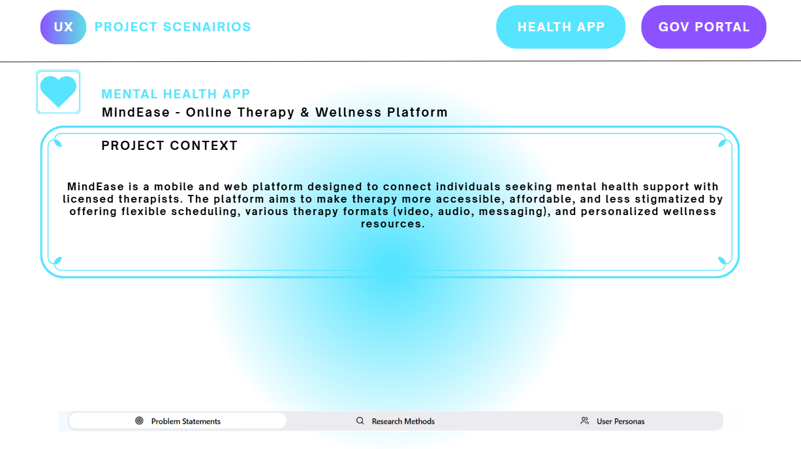
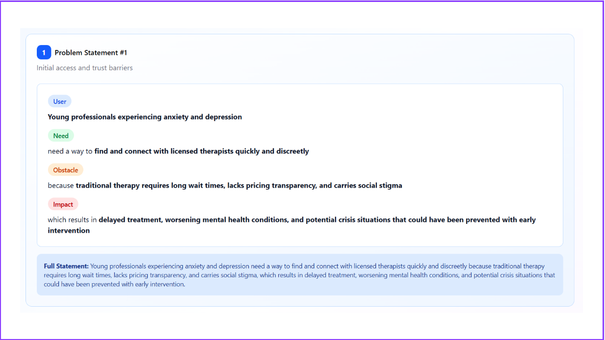
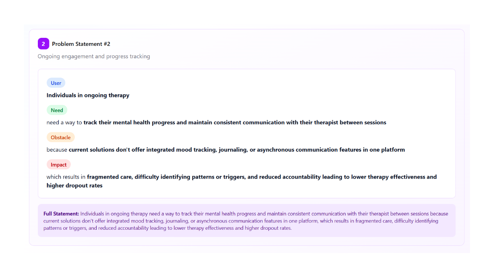
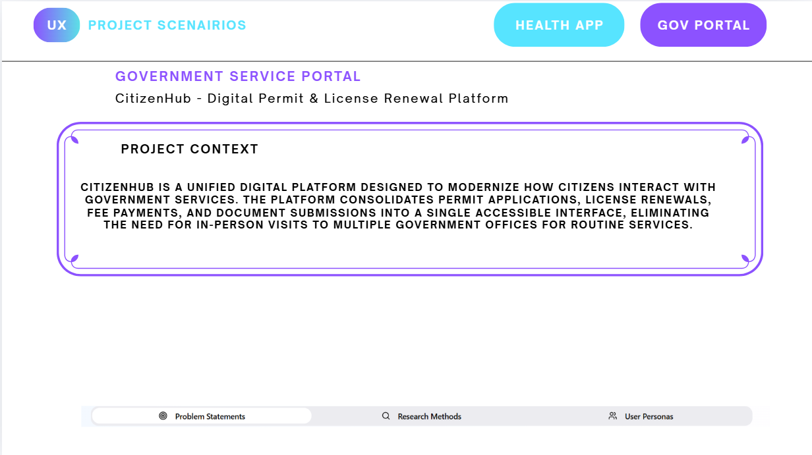
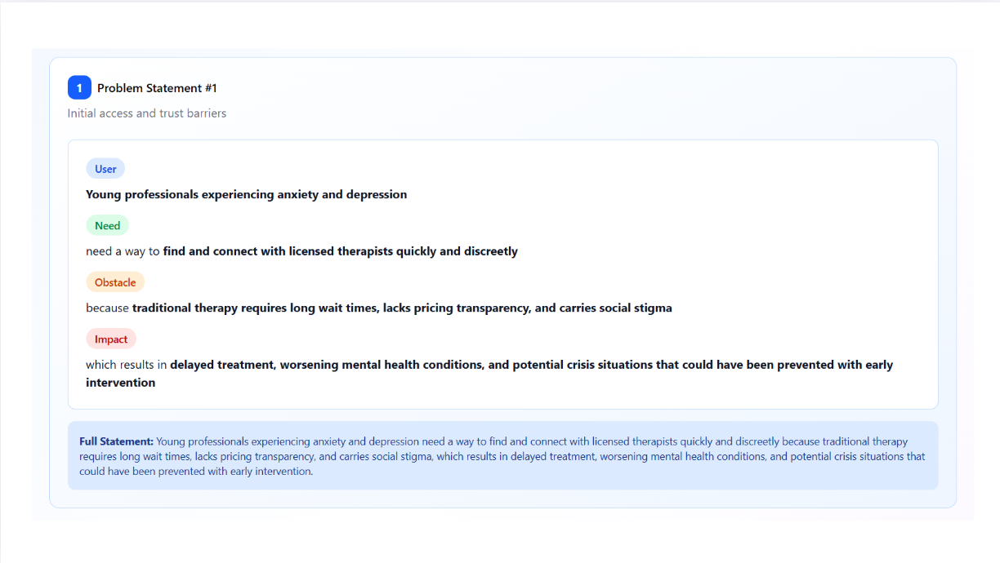
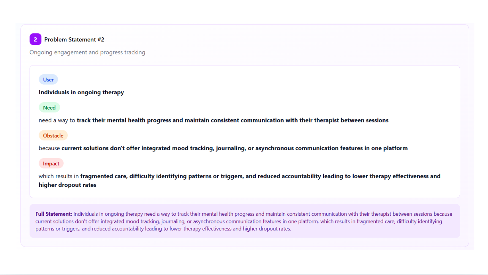

# UI-UX-Experiment5

## Aim:
To identify user problems in different application scenarios, formulate UX problem statements, select appropriate research methods, and create user personas for improving user experience in a health application and a government service portal.

## Algorithm:
Selected two UX scenarios:

Health Tracking Mobile Application

Government Service Portal

Identified user pain points such as:

Difficulty in navigation

Lack of awareness of services

Complex form filling process

Framed problem statements using the UX template:
"[User] needs a way to [goal] because [obstacle], which results in [impact]."

Selected suitable research methods:

Surveys

User Interviews

Usability Testing

Justified the research methods based on user type and system complexity.

Created user personas including:

Demographics

Goals

Behaviors

Pain points

Motivation

Compiled and documented all findings clearly

## Output:

## Result:
The experiment successfully identified usability issues in both a health tracking application and a government service portal.
